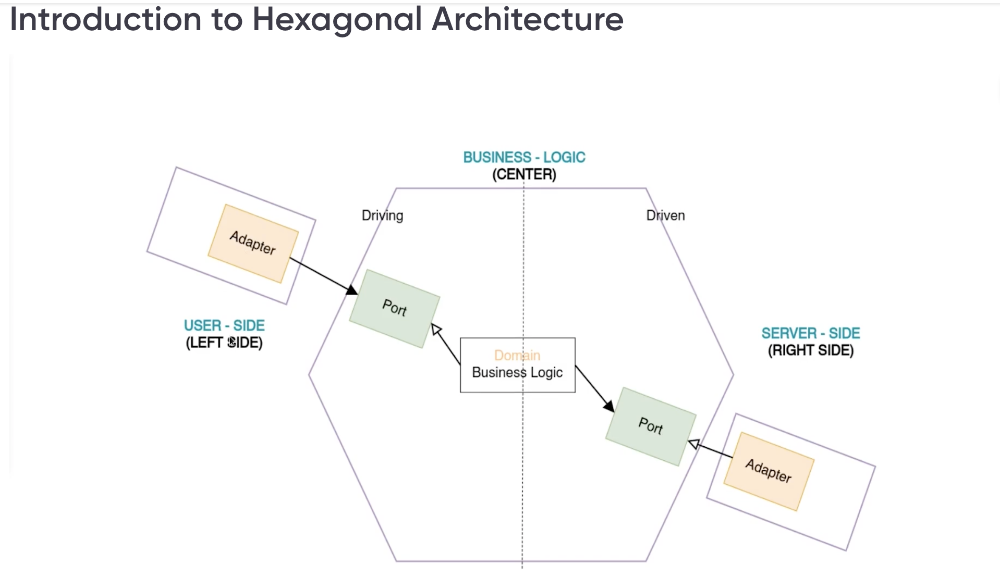
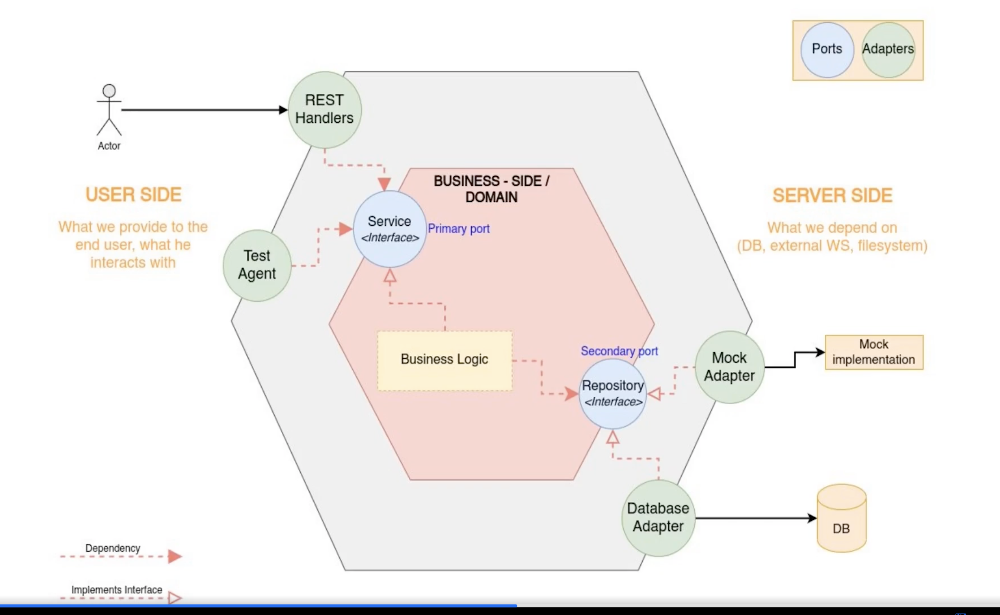

# Banking App
- Tutorial Reference: https://learning.oreilly.com/course/building-microservices-api/9781805124429/

# Hexagonal Architecture:
- Hexagonal Architecture is basically the "Dependency Inversion" applied at the software level.
- Uses "Ports" and "Adapters" for mutual conversation b/w the architecural components
- Leverages "Dependency Inversion" since all the Adapters are "configurable dependencies" that are interchangeable with interface implementations. 

